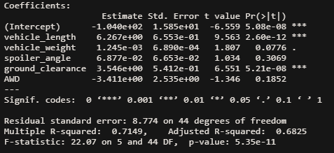
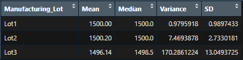
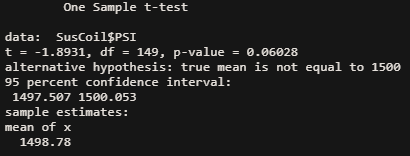
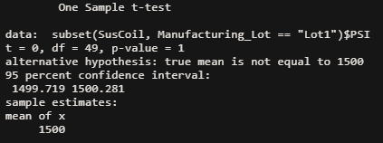
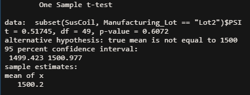
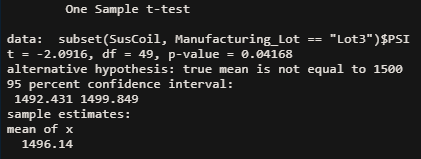

# MechaCar_Statistical_Analysis
## Linear Regression to Predict MPG
Below is an image of the multiple linear regression model attempting to predict miles per gallon(mpg) based on vehicle length, vehicle weight, spoiler angle, drivetrain, and ground clearance:

> Table 1.1

### Which variables/coefficients provided a non-random amount of variance to the mpg values in the dataset?
Each factor (coefficient) during a multiple linear regression has a corresponding p value represented above by "Pr(>|t|)". This represents the percent change the variable randomly explains the data. Where these p values are statistically significant or provide a non-random amount of variance to our dependent variable is when the p value < 0.05. For our model, vehicle length and ground clearance have p values less than 0.05 and thus provide a non-random amount of varaince to the miles per gallon(mpg) dependent variable.

### Is the slope of the linear model considered to be zero? Why or why not?
In our linear model, the p-value located at the bottom of the image above is related to the the null hypothesis that the slope of the linear model is equal to zero. If our p value is less than 0.05, then we reject our null hypothesis. Since our p value = 5.35x10-11, which is much less than 0.05, thus we reject the null hypothesis that the slope of our linear model is equal to zero. 

### Does this linear model predict mpg of MechaCar prototypes effectively? Why or why not?
In order to use our model to effectively predict MechaCar prototypes we need to look at our R-Squared statistic of 0.7149. This means that our linear model explains 71.49% of the variability in the miles per gallon of MechaCar prototypes. So the linear model predicts mpg somewhat well. However, we see that the intercept is statistically significant. This usually indicates that we need to scale up our vehicle length and ground clearance variables or that there are other variables not included in our dataset that explain the variablity in mpg of MechaCar prototypes. I would say there are other steps we can take to improve the predictive aspects of our linear model, so it does not predict mpg of MechaCar prototypes effectively.

## Summary Statistics on Suspension Coils
The question posed for this summary is: 
`
The design specifications for the MechaCar suspension coils dictate that the variance of the suspension coils must not exceed 100 pounds per square inch. Does the current manufacturing data meet this design specification for all manufacturing lots in total and each lot individually? Why or why not?
`
Table 2.1 shows the summary statistics for suspension coils for all the MechaCar prototypes. Table 2.2 shows the summary statistics for suspension coils for MechaCar prototypes based on Manufacturer Lot.

> Table 2.1

> Table 2.2

To answer the quesion posed, in table 2.1 we seed the variance for MechaCar prototypes is 62.29356. This falls under the 100 pounds per square inch that it is not to exceed. Therefore, the manufacturing data for all lots does meet the design specification.

However, if we look at each lot individually in table 2.2. We notice the variance for lot 1 and 2 are both under 10, whereas the variance in PSI for lot 3 is 170.286. The manufacturing data does meet the design specifications for lots 1 and 2, but it does not meet it for lot 3 as the variance in pounds per square inch is greater than 100.

## T-Tests on Suspension Coils
Below are one sample t tests run for PSI for MechaCars prototypes based on a population mean of 1,500 PSI. Therefore the null hypothesis of all of these t tests is the mean of the sample is 1,500 PSI. Table 3.1 is based on the total prototypes, Table 3.2 is only for prototypes in manufacturer lot 1, Table 3.3 is for prototypes in manufacturer lot 2, and Table 3.4 is for prototypes in manufacturer lot 3.

> Table 3.1

> Table 3.2

> Table 3.3

> Table 3.4

### Results

## Study Design: MechaCar vs Competition

